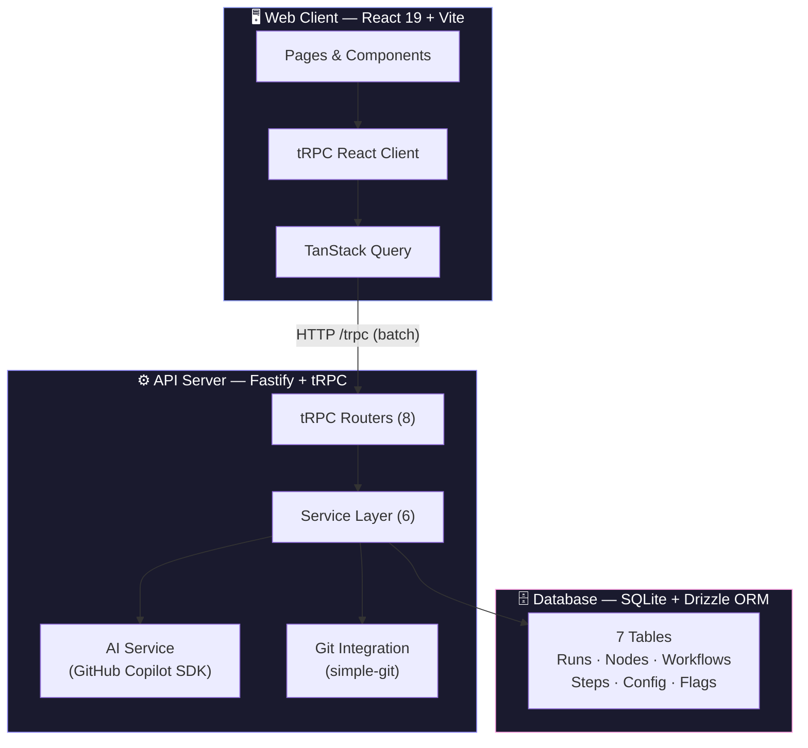
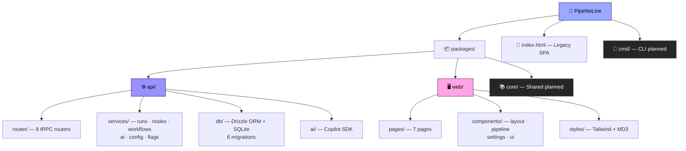
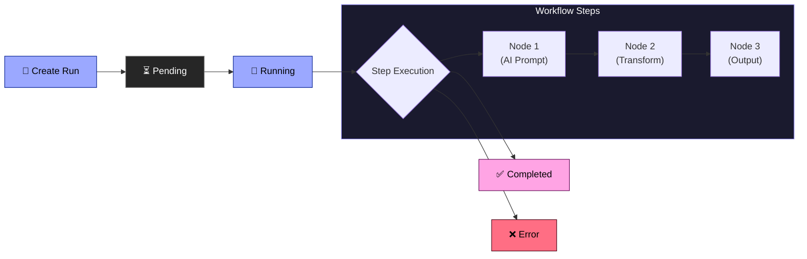
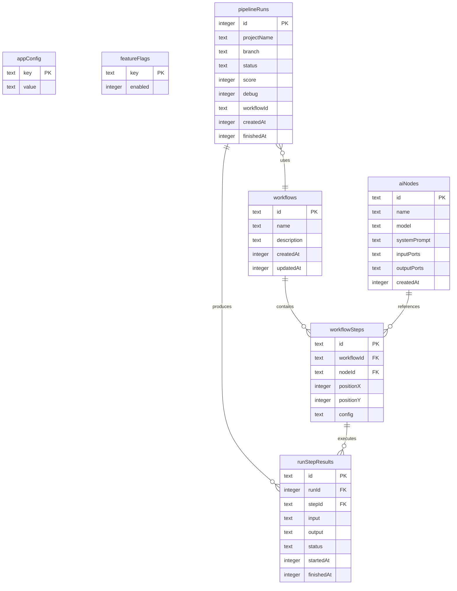

<p align="center">
  
</p>

<h1 align="center">⚡ PipeNoLine</h1>

<p align="center">
  <strong>DevOps Pipeline Orchestration Dashboard with AI-Powered Workflows</strong>
</p>

<p align="center">
  
  
  
  
  
  
  
  
</p>

<p align="center">
  
  
</p>

---

## 📋 Table of Contents

- [Overview](#-overview)
- [Architecture](#-architecture)
- [Project Structure](#-project-structure)
- [Features](#-features)
- [Tech Stack](#-tech-stack)
- [Getting Started](#-getting-started)
- [Database Schema](#-database-schema)
- [API Reference](#-api-reference)
- [Pages & UI](#-pages--ui)
- [Design System](#-design-system)
- [Scripts Reference](#-scripts-reference)
- [Contributing](#-contributing)

---

## 🔭 Overview

**PipeNoLine** (_"Kinetic Terminal"_) is a full-stack DevOps pipeline orchestration platform that lets you visually compose, execute, and monitor CI/CD workflows powered by AI nodes. Chain multiple AI models together, connect data ports between steps, and watch your pipelines execute in real time — all from a sleek dark-themed dashboard.

<p align="center">
  <picture>
    
  </picture>
  <picture>
    
  </picture>
  <picture>
    
  </picture>
</p>

---

## 🏗️ Architecture



### Data Flow

```
Browser → React Router → tRPC Client → HTTP Batch Link → /trpc
    → Vite Proxy (dev) → Fastify → tRPC Router → Service → Drizzle ORM → SQLite
```

> **Zero runtime coupling** — the web package imports only _types_ from the API package. Full type safety across the stack with no shared runtime code.

---

## 📂 Project Structure



```
PipeNoLine/
├── index.html                 # Legacy monolithic SPA
├── package.json               # Workspace root
├── pnpm-workspace.yaml        # pnpm monorepo config
│
├── packages/
│   ├── api/                   # Backend — Fastify + tRPC + Drizzle
│   │   ├── src/
│   │   │   ├── index.ts       # Server entry (port 3000)
│   │   │   ├── ai/            # GitHub Copilot SDK integration
│   │   │   ├── config/        # Config & feature flags services
│   │   │   ├── db/            # Schema, migrations, seed
│   │   │   ├── nodes/         # AI node service
│   │   │   ├── router/        # All tRPC routers
│   │   │   ├── runs/          # Pipeline run service
│   │   │   ├── types/         # IO port type definitions
│   │   │   └── workflows/     # Workflow service
│   │   └── data/              # SQLite database file
│   │
│   ├── web/                   # Frontend — React 19 + Vite
│   │   ├── src/
│   │   │   ├── App.tsx        # Root with tRPC + Query providers
│   │   │   ├── trpc.ts        # tRPC client setup
│   │   │   ├── components/    # UI components
│   │   │   ├── pages/         # Route pages
│   │   │   ├── data/          # Mock data
│   │   │   └── styles/        # Global CSS + Tailwind
│   │   └── vite.config.ts     # Vite + /trpc proxy
│   │
│   └── core/                  # Shared types (planned)
│
└── cmd/                       # CLI tooling (planned)
```

---

## ✨ Features

<table>
  <tr>
    <td align="center" width="33%">
      <br/>
      <strong>Real-Time Dashboard</strong><br/>
      <sub>Monitor all pipeline runs with 2s auto-polling. See status, score, duration, and branch info at a glance.</sub>
    </td>
    <td align="center" width="33%">
      <br/>
      <strong>Visual Workflow Editor</strong><br/>
      <sub>Drag-and-drop AI nodes onto a canvas. Draw connections between input/output ports with type compatibility checking.</sub>
    </td>
    <td align="center" width="33%">
      <br/>
      <strong>AI-Powered Nodes</strong><br/>
      <sub>Create nodes with custom models (GPT-4o, Claude, o1, etc.), system prompts, and typed I/O ports.</sub>
    </td>
  </tr>
  <tr>
    <td align="center">
      <br/>
      <strong>Pipeline Execution</strong><br/>
      <sub>Create runs from Git projects, select branches, assign workflows, toggle debug mode. Fire-and-forget async execution.</sub>
    </td>
    <td align="center">
      <br/>
      <strong>Git Integration</strong><br/>
      <sub>Auto-discover projects from a configured root path. List branches dynamically via simple-git.</sub>
    </td>
    <td align="center">
      <br/>
      <strong>Runtime Configuration</strong><br/>
      <sub>Manage project paths, AI settings, and feature flags — all from the Settings page without redeployment.</sub>
    </td>
  </tr>
</table>

### Pipeline Execution Flow



---

## 🛠️ Tech Stack

### Backend (`packages/api/`)

| Technology | Purpose |
|:--|:--|
|  | HTTP Server |
|  | Type-safe API layer |
|  | Database ORM |
|  | Embedded database |
|  | AI model inference |
|  | Schema validation |

### Frontend (`packages/web/`)

| Technology | Purpose |
|:--|:--|
|  | UI Framework |
|  | Build tool & dev server |
|  | Utility-first CSS |
|  | Client-side routing |
|  | Server state management |
|  | Icon system |

---

## 🚀 Getting Started

### Prerequisites

| Requirement | Version |
|:--|:--|
| Node.js | >= 18 |
| pnpm | 10.14.0 |

### Installation

```bash
# Clone the repository
git clone https://github.com/your-org/PipeNoLine.git
cd PipeNoLine

# Install dependencies (pnpm workspace)
pnpm install

# Run database migrations
cd packages/api && pnpm db:migrate && cd ../..

# Start development (API + Web concurrently)
pnpm run dev
```

### Access

| Service | URL |
|:--|:--|
| 🖥️ **Web UI** | [http://localhost:5173](http://localhost:5173) |
| ⚙️ **API Server** | [http://localhost:3000](http://localhost:3000) |
| 🗄️ **Drizzle Studio** | `pnpm --filter @pipenolinete/api db:studio` |

> The Vite dev server automatically proxies `/trpc` requests to the API server — no CORS configuration needed.

---

## 🗄️ Database Schema



| Table | Records | Purpose |
|:--|:--|:--|
| `appConfig` | Key-value pairs | System configuration (projects root, etc.) |
| `featureFlags` | Toggles | Runtime feature flags |
| `pipelineRuns` | Runs | Pipeline execution records with status tracking |
| `aiNodes` | Nodes | AI node definitions (model, prompts, ports) |
| `workflows` | Workflows | Pipeline workflow templates |
| `workflowSteps` | Steps | Individual steps with position & config |
| `runStepResults` | Results | Per-step execution results with timing |

---

## 📡 API Reference

All endpoints are exposed via **tRPC** at `/trpc`. The API is fully type-safe — the web client auto-infers types from the router definitions.

### tRPC Routers

<table>
  <tr>
    <th>Router</th>
    <th>Procedures</th>
    <th>Description</th>
  </tr>
  <tr>
    <td></td>
    <td><code>hello</code></td>
    <td>Health check endpoint</td>
  </tr>
  <tr>
    <td></td>
    <td><code>query</code> · <code>listSessions</code></td>
    <td>AI prompt execution & session management</td>
  </tr>
  <tr>
    <td></td>
    <td><code>get</code> · <code>set</code></td>
    <td>System configuration management</td>
  </tr>
  <tr>
    <td></td>
    <td><code>list</code> · <code>toggle</code></td>
    <td>Runtime feature flag control</td>
  </tr>
  <tr>
    <td></td>
    <td><code>list</code> · <code>branches</code></td>
    <td>Git project discovery & branch listing</td>
  </tr>
  <tr>
    <td></td>
    <td><code>list</code> · <code>get</code> · <code>create</code> · <code>getStepResults</code></td>
    <td>Pipeline run CRUD & execution</td>
  </tr>
  <tr>
    <td></td>
    <td><code>list</code> · <code>get</code> · <code>create</code> · <code>update</code> · <code>delete</code></td>
    <td>AI node management</td>
  </tr>
  <tr>
    <td></td>
    <td><code>list</code> · <code>get</code> · <code>create</code> · <code>update</code> · <code>delete</code> · <code>addStep</code> · <code>removeStep</code></td>
    <td>Workflow template management</td>
  </tr>
</table>

### Adding a New Procedure

1. Define the procedure in the appropriate router at `packages/api/src/router/`
2. It's immediately available on the web client via `trpc.<router>.<procedure>.useQuery()` or `.useMutation()`
3. Full type inference — no codegen needed

---

## 🖥️ Pages & UI

### Page Map

| Route | Page | Description |
|:--|:--|:--|
| `/` | **Dashboard** |  Overview of all pipeline runs with real-time 2s polling |
| `/run/new` | **Create Run** |  Select project, branch, workflow; toggle debug mode |
| `/run/:id` | **Run Detail** |  Step-by-step execution view with logs and timing |
| `/nodes` | **Nodes** |  Create & edit AI nodes with model, prompt, and I/O ports |
| `/workflows` | **Workflows** |  List & manage workflow templates |
| `/workflows/:id` | **Workflow Editor** |  Visual drag-and-drop node canvas with port connections |
| `/settings` | **Settings** |  System configuration and feature flags |

### Sidebar Navigation

```
┌──────────────────────┐
│  ⚡ PipeNoLine       │
├──────────────────────┤
│  📊 Overview         │  → /
│  🚀 Runs             │  → /
│  🧠 Nodes            │  → /nodes
│  🧩 Workflows        │  → /workflows
│  🔒 Vault            │  → (planned)
│  📈 Analytics        │  → (planned)
│  ⚙️ Settings         │  → /settings
└──────────────────────┘
```

### Status Badges

Pipeline runs use a consistent status badge system:

| Status | Style | Visual |
|:--|:--|:--|
| Pending | Outline |  |
| Running | Primary + Pulse |  |
| Done | Tertiary |  |
| Error | Error |  |

---

## 🎨 Design System

PipeNoLine follows **Material Design 3** color tokens with a **dark-first** theme.

### Color Palette

<table>
  <tr>
    <td align="center"><br/><strong>Primary</strong><br/><code>#9ba8ff</code></td>
    <td align="center"><br/><strong>Secondary</strong><br/><code>#9891fe</code></td>
    <td align="center"><br/><strong>Tertiary</strong><br/><code>#ffa4e4</code></td>
    <td align="center"><br/><strong>Error</strong><br/><code>#ff6e84</code></td>
  </tr>
  <tr>
    <td align="center"><br/><strong>Background</strong><br/><code>#0e0e0e</code></td>
    <td align="center"><br/><strong>Surface</strong><br/><code>#1a1a1a</code></td>
    <td align="center"><br/><strong>Surface Variant</strong><br/><code>#262626</code></td>
    <td align="center"><br/><strong>On Surface</strong><br/><code>#ffffff</code></td>
  </tr>
</table>

### Typography

| Role | Font | Usage |
|:--|:--|:--|
| **Headlines** | Space Grotesk | `font-headline` / `font-space-grotesk` |
| **Body** | Inter | `font-body` |
| **Labels** | Inter | `font-label` |

### Border Radius (Custom Scale)

| Class | Value | Use Case |
|:--|:--|:--|
| `rounded` | 0.125rem | Subtle rounding |
| `rounded-lg` | 0.25rem | Input fields |
| `rounded-xl` | 0.5rem | Cards |
| `rounded-full` | 0.75rem | Buttons, badges |

### Glass Morphism

Key surfaces use the `.glass-effect` class for a frosted-glass appearance with `backdrop-blur` and semi-transparent borders (`border-white/5`).

---

## 📜 Scripts Reference

### Root Workspace

```bash
pnpm install              # Install all workspace dependencies
pnpm run dev              # Start API + Web concurrently
pnpm run dev:api          # API server only (Fastify → :3000)
pnpm run dev:web          # Web dev server only (Vite → :5173)
```

### API Package

```bash
pnpm --filter @pipenolinete/api build       # TypeScript compile
pnpm --filter @pipenolinete/api dev         # Dev with watch mode
pnpm --filter @pipenolinete/api db:generate # Generate new migration
pnpm --filter @pipenolinete/api db:migrate  # Run migrations
pnpm --filter @pipenolinete/api db:studio   # Open Drizzle Studio
pnpm --filter @pipenolinete/api test        # Run tests (Vitest)
```

### Web Package

```bash
pnpm --filter @pipenolinete/web build       # Production build (Vite)
pnpm --filter @pipenolinete/web dev         # Dev server with HMR
pnpm --filter @pipenolinete/web test        # Run tests (Vitest)
```

---

## 🤝 Contributing

1. **Fork** the repository
2. **Create** a feature branch: `git checkout -b feature/my-feature`
3. **Install** dependencies: `pnpm install`
4. **Develop** with `pnpm run dev`
5. **Test** your changes: `pnpm test`
6. **Commit** with conventional commits: `git commit -m "feat: add workflow export"`
7. **Push** and open a Pull Request

### Code Conventions

- TypeScript strict mode everywhere
- tRPC procedures use Zod validation on all inputs
- UI follows Material Design 3 dark theme tokens
- Components use Tailwind utility classes (no CSS modules)
- Services are injected via tRPC context

---

<p align="center">
  
</p>

<p align="center">
  <sub>Made with ⚡ by the PipeNoLine team</sub>
</p>
